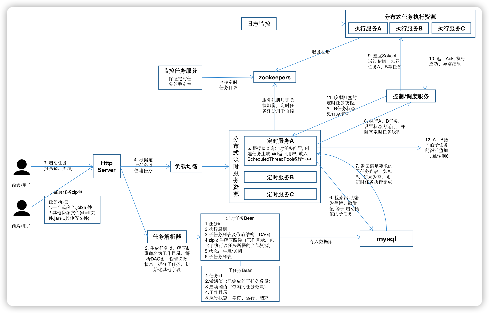

# 高可用任务调度系统

**架构图v0.2**

#### ~ 2022-07-03

1. 完成了定时任务和子任务的类、数据表的定义
2. 上传任务到数据库的编码
3. 完成了定时任务的启动和停止
4. 完成了部分DAG流程的执行

**注意**

任务调度模块只需与数据库进行交互，任务的**实时**执行状态、
任务的历史执行结果都将存储在数据库，因此http模块提供对外任务状态查询接口也只需要与数据库进行交互
